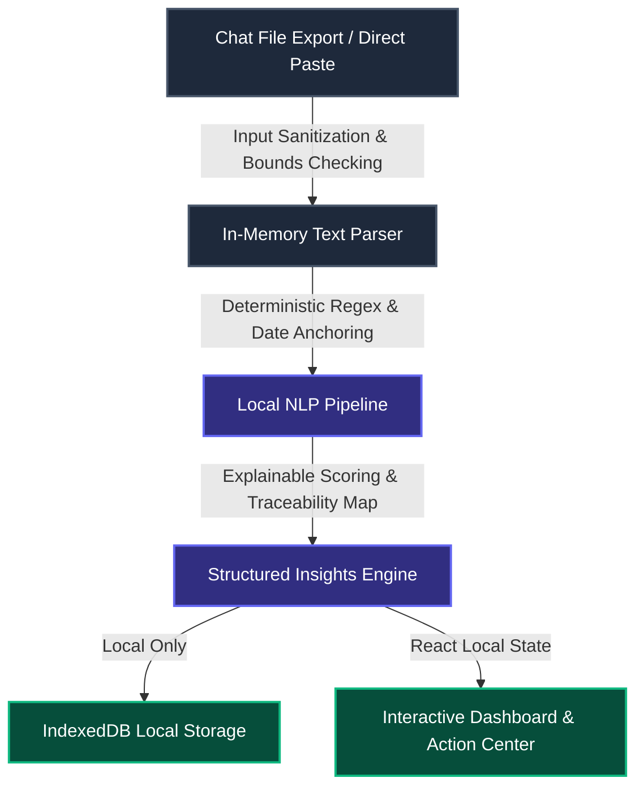

# Security Policy — UNREAD

## 1. Architectural Security Philosophy

UNREAD is designed from the ground up under a **zero-trust, local-first execution model**. The core architectural requirement of this project is that user chats, personal names, direct requests, and generated briefings **never leave the user's local device**.



## 2. Threat Model & Mitigations

| Threat | Impact | Implemented Mitigation |
| :--- | :--- | :--- |
| **Data Exfiltration / Cloud Leakage** | Private conversations sent to third-party AI APIs | **Pure local execution.** Zero outbound API requests. No telemetry, analytics pixels, or remote tracking. |
| **Cross-Site Scripting (XSS)** | Malicious chat content injecting script tags into the DOM | Input sanitization escapes HTML entities (`&`, `<`, `>`, `"`, `'`). React safe text node rendering prevents raw HTML execution. Strict Content Security Policy (CSP). |
| **Denial of Service (DoS / Memory Bloat)** | Adversary uploads massive multi-gigabyte chat files crashing the browser | Strict file size limit (10MB maximum), message cap (15,000 messages maximum), and message length bounds (10,000 characters per message). |
| **Model Hallucination & Fabrication** | AI inventing deadlines, fake tasks, or false task ownership | Deterministic NLP pipeline with strict pattern matching. Temporal date math is anchored directly to message timestamps. Every insight maintains an immutable evidence link to its original message ID. |
| **Insecure Local Storage** | Storage corruption or browser persistence errors | Isolated IndexedDB database with schema versioning and resilient fallback to in-memory store in restricted/private browsing modes. |

## 3. Content Security Policy (CSP)

The application enforces a strict Content Security Policy defined in `index.html`:
```http
default-src 'self';
script-src 'self' 'unsafe-inline';
style-src 'self' 'unsafe-inline' https://fonts.googleapis.com;
font-src 'self' https://fonts.gstatic.com data:;
img-src 'self' data: blob:;
connect-src 'self' http://localhost:11434;
```
*Notice:* Network connectivity is restricted exclusively to the same origin (`'self'`) and an optional local inference daemon at `http://localhost:11434`.

## 4. Reporting a Vulnerability

If you discover a security vulnerability in UNREAD, please do not file a public GitHub issue. Instead, report it privately by opening a security advisory on the GitHub repository or contacting the development team directly.
